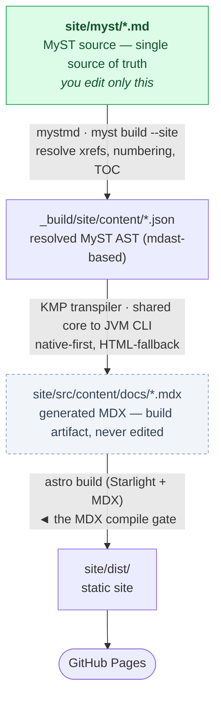

# MyST → Starlight Blueprint

> One MyST source → an interactive Starlight site, no duplication. A
> self-rendering docs stack with live code editing, unified search, and a shared
> theme, plus the Kotlin Multiplatform transpiler that wires MyST to Starlight.
> The repo builds itself as the example. Fork it as a template.

**[Live demo →](https://wstein.github.io/myst-starlight-blueprint/)** — the repo
you're reading deployed, live-JS editor included.

This repository is a **tech-stack idea**, not just a tool: a reference
architecture for documentation that has a single source of truth and still ships
an interactive web experience. The custom transpiler in `tool/` exists only to
make the idea cohere — it's the cog, not the point.

The proof is the repo itself: everything here is authored in MyST, transpiled to
MDX by the Kotlin Multiplatform tool, and built by Astro Starlight into the site
you deploy. Blueprint, template, and worked example in one.

## The idea in one picture



Everything downstream of the MyST source is regenerated on every build. The MDX
is gitignored on purpose: it is output, not source.

## Why this stack (the load-bearing decisions)

| Decision | Choice | Why |
|---|---|---|
| Web framework | **Astro Starlight** | Static-first, islands, Pagefind search, non-React |
| Structured source | **mystmd** (standalone, not Sphinx) | Semantic authoring; emits a resolved AST as JSON |
| Integration model | **Transpile to MDX**, don't inject HTML | MDX pages become *native* Starlight pages → shared theme, topbar, search, sidebar for free |
| Emit target | **MDX** (not Markdoc) | Human-reviewable output; escaping is solved, not hoped away |
| Tool language | **Kotlin Multiplatform** | One `commonMain` core → JVM **CLI** + JS **web**, from a single codebase |
| Live editor | **CodeMirror 6, vanilla** | Interactive island with **no React**, per the framework decision |
| Live eval | **Web Worker** | Runs example JS off the main thread, no DOM access |

## The custom tool: `tool/` (Kotlin Multiplatform)

A deliberate **orchestrator**, not a documentation engine. It doesn't parse MyST
(mystmd does) or render generic Markdown (MDX/Astro does). It owns exactly the
parts that encode *your policy*:

```
tool/src/
├── commonMain/…/blueprint/      ← the shared core, compiled to BOTH targets
│   ├── ast/MystNode.kt          resolved-AST model (tolerant JSON wrapper)
│   ├── escape/MdxEscaper.kt     the FOUR-channel escaper (prose / code / attr / JSX-HTML)
│   ├── emit/NodeMapping.kt      native-vs-fallback set + admonition collapse table
│   ├── emit/MdxEmitter.kt       native-first emitter (→ <Aside>, Expressive Code, links)
│   └── Transpiler.kt            frontmatter + imports + provenance banner
├── jvmMain/…/Cli.kt             JVM target → the CLI used in CI
├── jsMain/…/WebApi.kt           JS target → the browser playground (@JsExport)
└── commonTest/…/blueprint/      unit tests for the shared core, incl. a fixtures/
                                 package with a real mystmd AST capture — run via
                                 `gradle jvmTest`, wired into CI before `jvmJar`
```

The same `Transpiler.transpile(...)` runs in CI (a JVM jar walking JSON files)
and in the browser (a JS function behind a live playground) — "shared code for
CLI and web" satisfied by construction, not copy-paste.

**Escaping is retired, not risked.** Every character is routed through one of four
channels: prose is neutralised, code fences pass through verbatim, attributes are
entity-escaped, and the raw-HTML fallback emits JSX-valid markup. The build then
runs the real MDX compiler (`astro build`) as a gate, so correctness is verified —
not trusted (see [Honest caveats](#honest-caveats) for the one gap this doesn't close).

**Native where possible, fallback where not.** Admonitions and code are rewritten
to native `<Aside>` and Expressive Code, so they never reach the CSS shim
(`site/src/styles/myst-shim.css`) — which is why the permanent styling surface
stays tiny.

## The signature: live JS evaluation

`site/myst/index.md` contains a `js-eval` code block. The transpiler maps it to
`<CodeMirrorEval>` — a vanilla CodeMirror 6 island whose Run button posts the
editor contents to a sandboxed Web Worker and streams the console output back. No
React, no main-thread eval. [Try it on the live site →](https://wstein.github.io/myst-starlight-blueprint/)

## Use it as a template

1. Click **Use this template** on GitHub (or fork).
2. In `site/astro.config.mjs`, set `SITE = 'https://<you>.github.io'` and
   `BASE = '/<your-repo>'`.
3. Write MyST in `site/myst/`, list pages in `site/myst/myst.yml`'s `toc`.
4. Push to `main`. The workflow tests + builds the tool, resolves MyST,
   transpiles, builds Starlight, and deploys to Pages.

Locally: `make pipeline` runs the whole chain (needs JDK 21, Node 22, `mystmd`).
A `flake.nix` is provided — `nix develop` (or `direnv allow`, via the checked-in
`.envrc`) drops you into a shell with JDK 21, Node 22, and Gradle already on
`PATH` (matching CI); it still nudges you to `npm install -g mystmd` yourself.

## First run — do these before watching the Actions tab

Most first-push failures are configuration, not code:

- [ ] **Pages source = GitHub Actions.** Settings → Pages → Source → *GitHub
  Actions* (not "deploy from branch"), or the deploy job fails at the end.
- [ ] **Set `SITE` and `BASE`** in `astro.config.mjs` to your Pages URL and repo
  name — wrong `BASE` ships a site with broken CSS/links even on a green build.
- [ ] **Commit a Gradle wrapper:** `cd tool && gradle wrapper` once, then commit.
  CI's setup-gradle prefers it and it makes `./gradlew` work locally.
- [ ] **Verify the mystmd AST path.** Run `myst build --site` locally and confirm
  the JSON lands in `_build/site/content/`; if not, fix `--in` in the workflow
  and `Makefile`.
- [ ] **Check the pinned action majors.** Confirm the actions pinned in
  `.github/workflows/deploy.yml` are still current majors — GitHub's Security tab
  flags outdated actions on the repo once it's live.

The full chain — `myst build --site` → transpile → `astro build` — has been run
end-to-end locally against this repo's own content and produces a working
`site/dist/` (search index included). Three failures only surfaced by actually
running it, all now fixed here: `site/myst/myst.yml`'s `site.template: none`
wasn't a real template — `myst build --site` always resolves and downloads an
actual site template, so it 404'd looking one up literally named "none" (fixed
by pinning `template: book-theme`, which is what it silently falls back to
anyway if no valid template is given); `site/package-lock.json` wasn't
committed, so CI's `npm ci` had nothing to install from; and `astro.config.mjs`'s
`social` option used the array shape from Starlight ≥0.33 while `^0.30.0` (what
`npm install` actually resolves) expects an object keyed by platform name.

## Honest caveats

- **`MystNode` field assumptions are the ongoing risk.** `kind` on admonitions and
  `url` on resolved cross-references only fully surface when real content flows
  through; a wrong assumption silently falls through to the HTML fallback instead
  of failing a build. `tool/src/commonTest/.../RealAstFixtureTest.kt` grounds the
  suite in a real `mystmd build --site` capture to catch this class of bug —
  extend that fixture (or add new ones) whenever you lean on a new AST field.
- **Pinned versions are load-bearing, not decorative.** `@astrojs/starlight`
  changed the shape of the `social` config option between 0.30 and 0.33 — a
  caret range and the config calling it are coupled, and only `astro build`
  (not `astro check`, not the Kotlin test suite) catches a mismatch. Re-run the
  full pipeline after bumping anything in `site/package.json`.
- **Web Worker is isolation, not a security sandbox.** Fine for trusted docs
  examples; don't run untrusted third-party code through it.
- **Static live-eval only.** MyST's executable/notebook features are intentionally
  out of scope; this path renders static output by design.
- **Starlight inner aside markup.** The emitter targets `<Aside>`; if you ever
  bypass it and hand-write aside classes, match Starlight's rendered structure.

## Suggested repo topics

`myst` · `starlight` · `astro` · `mdx` · `documentation` · `single-source` ·
`kotlin-multiplatform` · `github-pages`

## Layout

```
.
├── README.md                     ← this blueprint
├── CLAUDE.md                     ← guidance for Claude Code when working in this repo
├── LICENSE                       ← MIT
├── Makefile                      ← `make pipeline`
├── package.json                  ← npm-script equivalents
├── flake.nix                     ← `nix develop` — JDK 21 + Node 22 + Gradle
├── .github/workflows/deploy.yml  ← self-render → GitHub Pages (+ MDX compile gate)
├── tool/                         ← Kotlin Multiplatform transpiler (CLI + web + tests)
└── site/                         ← Astro Starlight + MyST source + live-eval island
    ├── myst/                     ← MyST source of truth
    ├── src/components/           ← CodeMirrorEval.astro + eval-worker.ts
    ├── src/styles/myst-shim.css  ← orphan-construct shim (Starlight tokens)
    └── astro.config.mjs
```

## License

MIT — see [LICENSE](LICENSE).
